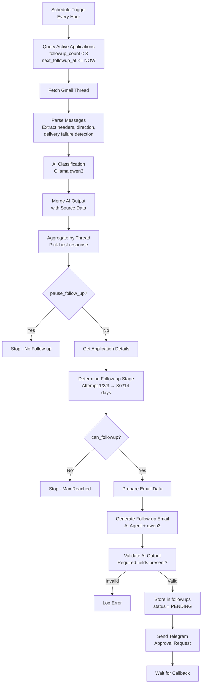
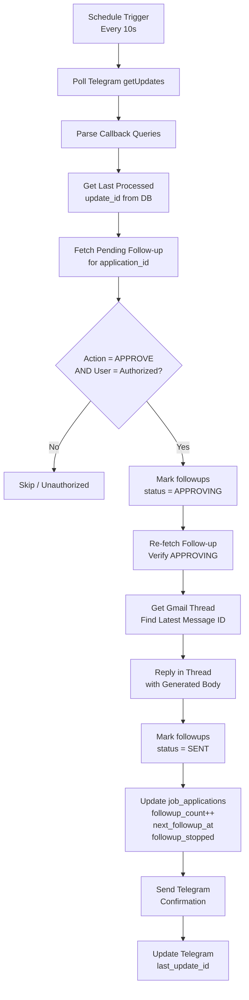

# AI Job Follow-Up Agent

> **Automated job application follow-up system** — monitors Gmail threads, classifies responses with AI, generates personalized follow-up emails, and requires human approval via Telegram before sending.

---

## Problem

Job seekers face these challenges:

| Challenge | Impact |
|-----------|--------|
| **Manual tracking** | Spreadsheets become stale; follow-ups slip through cracks |
| **Timing guesswork** | No data-driven schedule for when to follow up |
| **Response blindness** | Can't automatically detect replies (interview invites, rejections, assessments) |
| **Context loss** | Forgetting thread details when drafting follow-ups |
| **No safety net** | Accidental sends to wrong person or after rejection |

---

## Solution

An **end-to-end automation** that:

1. **Monitors** Gmail threads for job applications on a schedule
2. **Classifies** every message via local LLM (Ollama + qwen3) into: `NO_RESPONSE`, `ACKNOWLEDGEMENT`, `INTERVIEW`, `ASSESSMENT`, `REJECTION`, `HR_RESPONSE`, `ACTION_REQUIRED`, `DELIVERY_FAILURE`
3. **Decides** whether a follow-up is warranted (skips if meaningful response received)
4. **Generates** personalized follow-up emails preserving exact company, role, recipient, thread ID
5. **Requests approval** via Telegram with inline buttons (✅ APPROVE / ⏭️ SKIP)
6. **Sends** on approval — replies in the same Gmail thread
7. **Tracks** state in PostgreSQL (follow-up count, next due date, stop conditions)
8. **Dashboards** everything in a Streamlit UI

---

## Architecture

```
┌─────────────────┐     ┌──────────────────┐     ┌─────────────────┐
│   Scheduler     │────▶│  PostgreSQL DB   │◀───│   Dashboard     │
│   (n8n cron)    │     │  (job_applications,│     │  (Streamlit)    │
└────────┬────────┘     │   followups,     │     └─────────────────┘
         │              │   telegram_bot_state)│
         ▼              └────────┬─────────┘
┌─────────────────┐             │
│  Gmail API      │             │
│  (fetch thread) │             │
└────────┬────────┘             │
         ▼                      │
┌─────────────────┐             │
│  Code Node      │             │
│  (parse msg)    │             │
└────────┬────────┘             │
         ▼                      │
┌─────────────────┐             │
│  AI Agent       │─────────────┤
│  (Ollama qwen3) │  classification
└────────┬────────┘             │
         ▼                      │
┌─────────────────┐             │
│  Aggregation    │             │
│  (thread-level) │             │
└────────┬────────┘             │
         ▼                      │
┌─────────────────┐             │
│  Decision Logic │             │
│  (pause/stop?)  │             │
└────────┬────────┘             │
         ▼                      │
┌─────────────────┐             │
│  Generate Email │             │
│  (AI + template)│             │
└────────┬────────┘             │
         ▼                      │
┌─────────────────┐             │
│  Store PENDING  │─────────────┤
│  in followups   │             │
└────────┬────────┘             │
         ▼                      │
┌─────────────────┐             │
│  Telegram Bot   │             │
│  (approval)     │             │
└────────┬────────┘             │
         │                      │
    ┌────┴────┐                 │
    ▼         ▼                 │
 APPROVE   SKIP                 │
    │         │                 │
    ▼         ▼                 │
┌─────────┐ ┌─────────┐         │
│ Gmail   │ │ Update  │         │
│ Reply   │ │ State   │         │
└────┬────┘ └────┬────┘         │
     │          │               │
     └────┬─────┘               │
          ▼                     │
    ┌───────────┐               │
    │ Telegram  │               │
    │ Notify    │               │
    └───────────┘               │
```

---

## Flow Diagram

### Workflow 1: Job Follow-Up Scheduler (runs hourly)



### Workflow 2: Telegram Approval Handler (runs every 10s)



---

## Components

### 1. n8n Workflows (`n8n/`)

| Workflow | File | Trigger | Purpose |
|----------|------|---------|---------|
| **Scheduler** | `Job Follow-Up Scheduler Final.json` | Hourly | Core automation: detect → classify → generate → queue for approval |
| **Approval Handler** | `Telegram Follow-Up Approval Handler.json` | Every 10s | Poll Telegram callbacks, send approved emails, update state |

### 2. Dashboard (`dashboard/app.py`)

Streamlit app connecting to PostgreSQL on port 15432. Shows:
- Total / Active applications
- Follow-ups sent count
- Applications requiring action
- Full table with all fields

### 3. Database (PostgreSQL 16)

**Tables** (inferred from queries):

```sql
-- Core application tracking
job_applications (
  id              SERIAL PRIMARY KEY,
  company         TEXT,
  role            TEXT,
  recipient_email TEXT,
  recipient_name  TEXT,
  application_date TIMESTAMPTZ,
  gmail_thread_id TEXT,
  status          TEXT,           -- 'ACTIVE', etc.
  followup_count  INT DEFAULT 0,
  next_followup_at TIMESTAMPTZ,
  last_followup_at TIMESTAMPTZ,
  pause_follow_up BOOLEAN DEFAULT FALSE,
  followup_stopped BOOLEAN DEFAULT FALSE,
  source          TEXT,
  priority        TEXT,
  requires_action BOOLEAN DEFAULT FALSE,
  updated_at      TIMESTAMPTZ
);

-- Generated follow-ups awaiting approval
followups (
  id              SERIAL PRIMARY KEY,
  application_id  INT REFERENCES job_applications(id),
  attempt_number  INT,
  generated_subject TEXT,
  generated_body  TEXT,
  status          TEXT,           -- 'PENDING', 'APPROVING', 'SENT'
  approved_at     TIMESTAMPTZ,
  sent_at         TIMESTAMPTZ
);

-- Telegram bot offset tracking
telegram_bot_state (
  key   TEXT PRIMARY KEY,        -- 'last_update_id'
  value TEXT
);
```

### 4. Infrastructure (`docker-compose.yml`)

| Service | Image | Port | Purpose |
|---------|-------|------|---------|
| `postgres` | `postgres:16` | 15432 | Primary database |
| `n8n` | `docker.n8n.io/n8nio/n8n:latest` | 5678 | Workflow engine |

Volumes: `postgres_data`, `n8n_data`

---

## Automation Details

### Scheduler Workflow — Node by Node

| Node | Type | Key Logic |
|------|------|-----------|
| **Schedule Trigger** | `scheduleTrigger` | Runs hourly |
| **Execute SQL query** | `postgres` | Finds applications due for follow-up |
| **Get a thread** | `gmail` | Fetches full thread by `gmail_thread_id` |
| **Code in JavaScript** | `code` | Parses Gmail payload: extracts headers, determines `is_sent`, `is_incoming`, `is_delivery_failure`, builds clean message objects |
| **AI Agent** | `@n8n/n8n-nodes-langchain.agent` | Classifies each message using structured prompt + Ollama qwen3 |
| **Ollama Chat Model** | `lmChatOllama` | Local LLM (qwen3:latest) |
| **Code in JavaScript1** | `code` | Merges AI classification back with source message data |
| **Code in JavaScript2** | `code` | Groups by thread, sorts chronologically, picks highest-priority response per priority: `MEANINGFUL` > `DELIVERY_FAILURE` > `ACKNOWLEDGEMENT` > `NO_RESPONSE` |
| **If (pause_follow_up)** | `if` | Branches: if AI says pause → stop |
| **Get Application Details** | `postgres` | Loads full application row for email generation |
| **Determine Follow-Up Stage** | `code` | Maps `followup_count` → attempt # and interval: 1→3d, 2→7d, 3→14d |
| **If1 (can_followup)** | `if` | Stops if attempt > 3 |
| **repare Follow-Up Email Data** | `code` | Shapes payload for generator |
| **Generate Follow-Up Email** | `@n8n/n8n-nodes-langchain.agent` | AI writes email with strict rules: preserve IDs, company, role, recipient exactly |
| **Ollama Chat Model1** | `lmChatOllama` | Same local model |
| **Code in JavaScript3** | `code` | Parses AI JSON, validates required fields (`application_id`, `gmail_thread_id`, `company`, `role`, `subject`, `body`) |
| **If2 (ai_valid)** | `if` | Only proceeds if validation passes |
| **Execute SQL query2** | `postgres` | Inserts/updates `followups` row with `status = PENDING` |
| **Execute SQL query3** | `postgres` | Reads the pending follow-up for Telegram |
| **Send a text message** | `telegram` | Sends formatted message with inline keyboard: `APPROVE:<id>` / `SKIP:<id>` |

### Approval Handler Workflow — Node by Node

| Node | Type | Key Logic |
|------|------|-----------|
| **Schedule Trigger** | `scheduleTrigger` | Every 10 seconds |
| **Execute SQL query** | `postgres` | Reads `last_update_id` from `telegram_bot_state` |
| **HTTP Request** | `httpRequest` | Calls `getUpdates` with offset |
| **Code in JavaScript** | `code` | Extracts callback queries, parses `APPROVE:<id>` / `SKIP:<id>` |
| **Execute SQL query1** | `postgres` | Fetches pending follow-up for that application |
| **If (APPROVE + authorized user)** | `if` | Only proceeds for correct user (1693532806) and action |
| **Execute SQL query2** | `postgres` | Marks follow-up `APPROVING` |
| **Execute SQL query3** | `postgres` | Re-verifies `APPROVING` state |
| **Get a thread** | `gmail` | Fetches thread to find latest message ID |
| **Code in JavaScript1** | `code` | Finds latest message ID for `reply` |
| **Reply to a message** | `gmail` | Sends follow-up as reply in same thread |
| **Mark Follow-Up as SENT** | `postgres` | Updates `followups` status, `sent_at` |
| **Update Application Follow-Up State** | `postgres` | Increments `followup_count`, sets `next_followup_at` (7/14d), stops at 3 |
| **Execute SQL query4** | `postgres` | (Appears to be a one-time reset for IDs 1-6) |
| **Send a text message** | `telegram` | Confirms send with next follow-up date |
| **Update Telegram Offset** | `postgres` | Stores max `update_id` processed |

---

## AI Prompts

### Classification Prompt (Scheduler)

```
You are an AI email response classifier for a personal job application 
follow-up automation system.

Analyze the current Gmail message and classify what happened after a 
job application.

CLASSIFICATIONS:
- NO_RESPONSE
- ACKNOWLEDGEMENT
- INTERVIEW
- ASSESSMENT
- REJECTION
- HR_RESPONSE
- ACTION_REQUIRED
- DELIVERY_FAILURE
```

Rules include explicit examples for each class. Output is forced JSON.

### Email Generation Prompt (Scheduler)

```
You are a professional job-application follow-up email generator.

Generate exactly ONE follow-up email for the existing job application.

STRICT RULES:
- Preserve Application ID, Gmail Thread ID, Follow-up Attempt, 
  Company, Role, Recipient Email, Recipient Name EXACTLY
- If Company missing → return ai_valid: false
- Use exact Role value (no shortening)
- Address recipient by exact name if provided
- Professional, concise, reference original application date
- Include Application ID and Gmail Thread ID in output JSON
```

Output schema enforced:
```json
{
  "application_id": "...",
  "gmail_thread_id": "...",
  "followup_attempt": 1,
  "company": "...",
  "role": "...",
  "recipient_email": "...",
  "recipient_name": "...",
  "subject": "...",
  "body": "...",
  "ai_valid": true,
  "reason": ""
}
```

---

## Setup

### Prerequisites

- Docker & Docker Compose
- n8n instance (via docker-compose)
- Ollama running locally with `qwen3:latest` model
- Gmail OAuth2 credentials
- Telegram Bot token & Chat ID
- PostgreSQL (provided by docker-compose)

### Environment Variables (`.env`)

```bash
POSTGRES_USER=your_postgres_user
POSTGRES_PASSWORD=your_postgres_password
POSTGRES_DB=jobagent
POSTGRES_PORT=15432

TELEGRAM_BOT_TOKEN=your_telegram_bot_token
TELEGRAM_CHAT_ID=your_telegram_chat_id

OLLAMA_BASE_URL=http://host.docker.internal:11434
```

### Start Services

```bash
docker-compose up -d
```

### Import n8n Workflows

1. Open n8n at `http://localhost:5678`
2. Import both JSON files from `n8n/`
3. Configure credentials:
   - PostgreSQL (host: `postgres`, port: 5432, db: `jobagent`, user: `jobagent`)
   - Gmail OAuth2
   - Telegram API
   - Ollama API (`http://host.docker.internal:11434`)
4. Activate both workflows

### Run Dashboard

```bash
cd dashboard
pip install -r requirements.txt  # streamlit, psycopg2, pandas
streamlit run app.py
```

Access at `http://localhost:8501`

---

## Data Flow Summary

```
User applies to job
       │
       ▼
Insert row into job_applications
       │
       ▼
[Hourly] Scheduler queries due applications
       │
       ▼
Fetch Gmail thread → Parse → AI classify
       │
       ▼
Meaningful response? ──Yes──▶ Pause/Stop follow-ups
       │No
       ▼
Generate follow-up email (AI)
       │
       ▼
Store in followups (PENDING)
       │
       ▼
Telegram: "Approve this follow-up?"
       │
       ├─ APPROVE ──▶ Reply in Gmail thread ──▶ Update counts/dates
       │
       └─ SKIP ─────▶ Mark skipped, no send
```

---

## Key Design Decisions

| Decision | Rationale |
|----------|-----------|
| **Local LLM (Ollama)** | No API costs, data privacy, offline capable |
| **n8n as orchestrator** | Visual workflow, built-in retries, credential management, easy debugging |
| **Human-in-the-loop** | Prevents accidental sends; approval via familiar Telegram UI |
| **Reply in same thread** | Keeps conversation context; professional appearance |
| **Max 3 follow-ups** | Avoids spam; diminishing returns after 3 |
| **Exponential backoff** | 3d → 7d → 14d respects recruiter time |
| **Thread-level aggregation** | One decision per application, not per message |
| **Delivery failure detection** | Stops follow-ups to bounced addresses automatically |

---

## Extending

- **Add new classification**: Update AI prompt + aggregation logic in `Code in JavaScript2`
- **Change follow-up schedule**: Modify `Determine Follow-Up Stage` code node
- **Add Slack/Email notifications**: Add nodes after Telegram confirmation
- **Multi-user**: Add `user_id` to tables, filter by owner in queries
- **Webhook instead of polling**: Replace Telegram `getUpdates` polling with webhook endpoint

---

## License

MIT — use freely for personal job search automation.# autonomous-job-followup-agent

